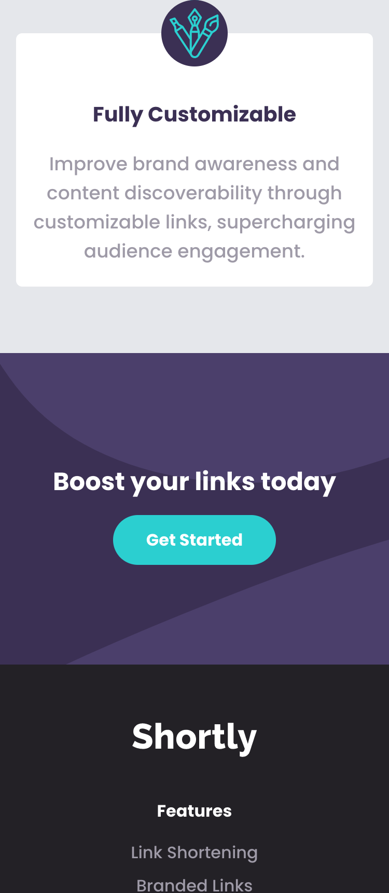

# Frontend Mentor - Shortly URL shortening API Challenge solution

## Table of contents

- [Overview](#overview)
  - [The challenge](#the-challenge)
  - [Screenshot](#screenshot)
  - [Links](#links)
- [My process](#my-process)
  - [Built with](#built-with)
  - [What I learned](#what-i-learned)
  - [Continued development](#continued-development)
  - [Useful resources](#useful-resources)
- [Author](#author)
- [Acknowledgments](#acknowledgments)

## Overview

Shortly is a site a user can use to reduce long url to short url, the site is built using reactjs, html, tailwindcss and google fonts. User can see all the list of urls they shorten and can also copy the the link to their system clipboard while they are on secure connection. I learnt alot during the development phase of this web app, starting from learning tailwindcss to understanding layout more. The experience is different with frontend mentor.

### The challenge

Users should be able to:

- View the optimal layout for the site depending on their device's screen size
- Shorten any valid URL
- See a list of their shortened links, even after refreshing the browser
- Copy the shortened link to their clipboard in a single click
- Receive an error message when the `form` is submitted if:
  - The `input` field is empty

### Screenshot

.png)

### Links

- Solution URL: [Add solution URL here](https://github.com/ahmedsaliuGit/url-shortener/)
- Live Site URL: [Add live site URL here](https://ahmedsaliugit.github.io/url-shortener/)

## My process

### Built with

- Semantic HTML5 markup
- CSS custom properties
- Flexbox
- Mobile-first workflow
- [React](https://reactjs.org/) - JS library
- [Tailwind](https://tailwind.com/) - For utilities-first classes

## Author

- Website - [Ahmed Saliu](https://github.com/ahmedsaliuGit/)
- Frontend Mentor - [@ahmedsaliuGit](https://www.frontendmentor.io/profile/ahmedsaliuGit)

## Acknowledgments

Special thanks to @Matt for giving us a platform like frontend mentor. THANK YOU!
